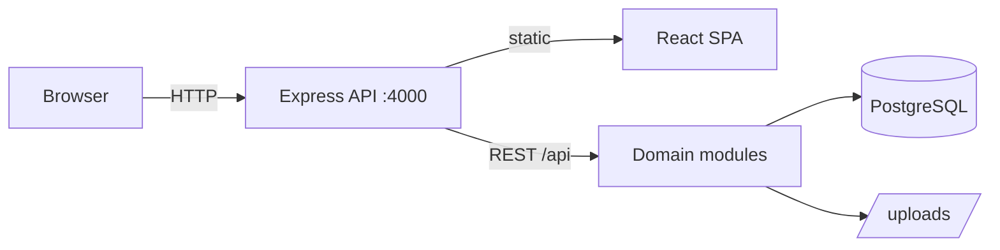

# VK Trading ERP — Web Edition

Browser-based ERP and CRM for coal trading — purchases, sales, FIFO inventory, batches, P&L, GST, payments, and reports. This repository is the **web clone** of [Coal-ERP](https://github.com/shahronit/Coal-ERP) (desktop + server). No Electron required.

---

## Quick start (local development)

**Prerequisites:** Node.js 20+, Docker (for PostgreSQL)

```bash
# 1. Clone and install
git clone https://github.com/shahronit/Coal-ERP-Web.git
cd Coal-ERP-Web
npm install

# 2. Start PostgreSQL
npm run db:up

# 3. Configure backend
cp backend/.env.example backend/.env
# Edit JWT secrets if needed

# 4. Run migrations + dev servers (UI :5173, API :4000)
cd backend && npm run db:migrate && cd ..
npm run dev
```

Open **http://localhost:5173** — the Vite dev server proxies `/api` to the backend.

Default login (after first-run seed): `superadmin@tradecrm.com` / `Demo@123`

---

## Production (single server)

Build the UI and serve everything from Express on port **4000**:

```bash
npm run db:up
cp backend/.env.example backend/.env
npm run start
```

Open **http://localhost:4000** — API + SPA from one process.

Set strong `JWT_*` secrets and update `CORS_ALLOWED_ORIGINS` / `FRONTEND_URL` for your domain.

---

## Docker (full stack)

Runs PostgreSQL + app (built frontend + API) in containers:

```bash
# Optional: set secrets in .env at repo root
echo "JWT_ACCESS_SECRET=$(openssl rand -hex 48)" >> .env
echo "JWT_REFRESH_SECRET=$(openssl rand -hex 48)" >> .env

npm run docker:up
```

Open **http://localhost:4000**

```bash
npm run docker:logs   # follow app logs
npm run docker:down   # stop stack
```

---

## Architecture



| Layer | Path | Role |
|-------|------|------|
| Frontend | `frontend/` | React 19, Vite, MUI, Redux Toolkit |
| Backend | `backend/` | Express, Prisma, FIFO, reports |
| Database | Docker / external Postgres | Shared multi-user data |

---

## Scripts

| Command | Description |
|---------|-------------|
| `npm run dev` | Frontend (5173) + API (4000) with hot reload |
| `npm run build` | Build React app + generate Prisma client |
| `npm run start` | Build + migrate + serve on :4000 |
| `npm run db:up` | Start PostgreSQL container only |
| `npm run docker:up` | Full stack in Docker |
| `npm test` | Backend integration tests |

---

## Deployment options

1. **Office server** — `npm run start` on a PC with `HOST=0.0.0.0`; access via LAN or [Tailscale](https://tailscale.com).
2. **Docker VPS** — `docker compose up -d` on any Linux host.
3. **Firebase** — use `DATABASE_PROVIDER=firestore` and Firebase Hosting rewrites (see `firebase/` folder; copied from desktop repo).

---

## Differences from desktop repo

| Desktop (Coal-ERP) | Web (this repo) |
|--------------------|-----------------|
| Electron shell | Browser only |
| `npm run start:desktop` | `npm run dev` / `npm run start` |
| Local userData paths | Server `uploads/` + shared Postgres |
| Backup folder picker (native) | Web settings use server paths |

Desktop-only settings (native folder dialogs, app restart) are hidden automatically when `window.electronAPI` is absent.

---

## License

MIT — see [LICENSE](LICENSE).
