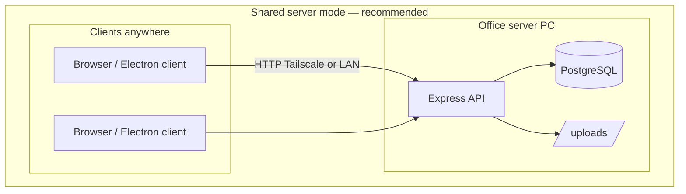
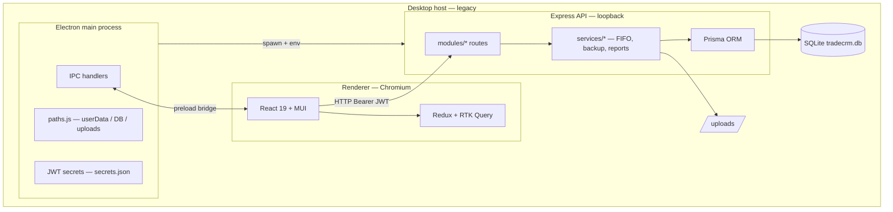
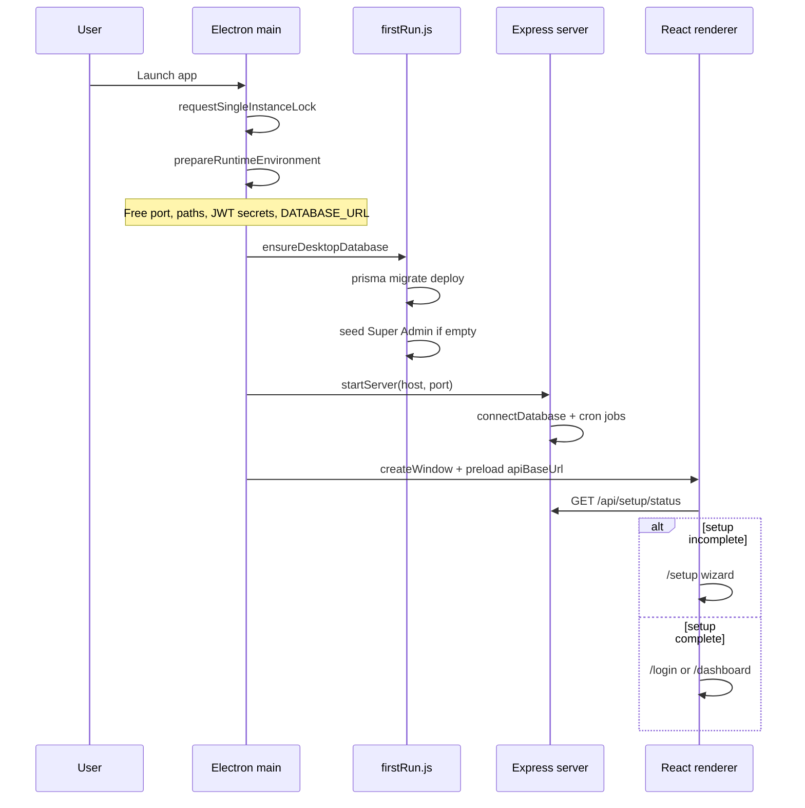
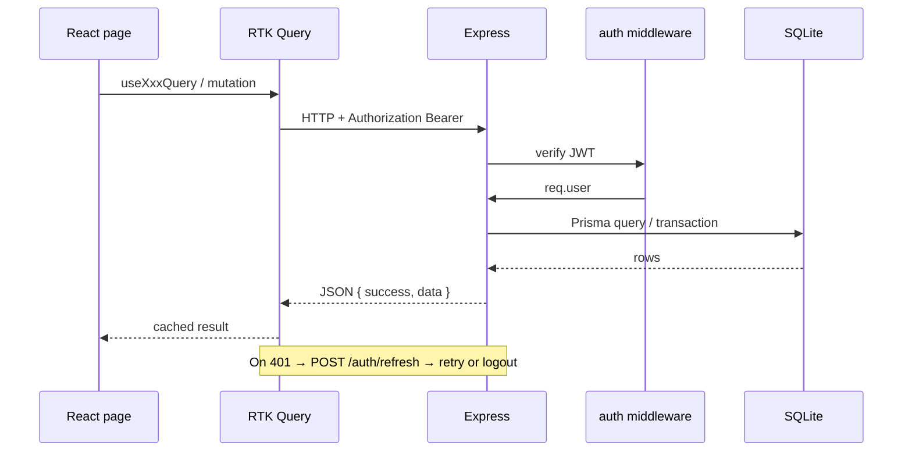
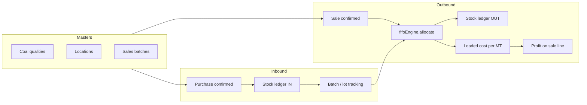
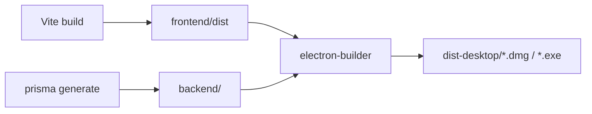

# VK Trading ERP — Architecture

This document describes how the desktop application is structured, how processes communicate, and how core business flows move through the stack.

---

## System overview

VK Trading ERP is a **single-user-desktop, multi-process** application:

| Process | Role |
|---------|------|
| **Electron main** | Window lifecycle, IPC, paths, JWT secrets, backend bootstrap |
| **Express API** | REST API on loopback (`127.0.0.1`), in-process with Electron |
| **React renderer** | SPA UI; talks to API via RTK Query |
| **SQLite** | Legacy local persistence (deprecated; use PostgreSQL shared server) |

There is no external cloud requirement. Production can run as a **single office server** with PostgreSQL, or legacy per-desktop SQLite.



Legacy desktop (deprecated):



---

## Layer responsibilities

### Electron (`electron/`)

| File | Purpose |
|------|---------|
| `main.js` | App entry, single-instance lock, window creation, backend start/stop |
| `paths.js` | Resolves `userData`, database path, uploads, settings, backup defaults |
| `preload.js` | Exposes `window.electronAPI` (API base URL, native dialogs, restart) |
| `startup.js` | Database lock detection before open |

On launch, main process:

1. Reserves a free loopback port
2. Writes runtime env vars (`TRADECRM_*`, `DATABASE_URL`, JWT secrets)
3. Runs `ensureDesktopDatabase()` (migrations + demo admin seed)
4. Starts Express via `backend/src/server.js`
5. Loads the UI (Vite dev URL or static `index.html` served by Express)

### Backend (`backend/src/`)

| Area | Purpose |
|------|---------|
| `modules/` | Feature slices — routes → controller → service → Prisma |
| `services/` | Cross-cutting domain logic (FIFO engine, backups, demo seed, app settings) |
| `desktop/firstRun.js` | Prisma migrate deploy, initial Super Admin, setup flags |
| `utils/joiFields.js` | Shared Joi field builders with labeled validation messages |
| `middleware/` | Auth, error handling, request timing |
| `jobs/` | Notification cron (started with server) |

**Module pattern:** each domain (purchases, sales, reports, …) exposes an Express router. Validators use Joi; services encapsulate transactions; controllers map HTTP ↔ service.

### Frontend (`frontend/src/`)

| Area | Purpose |
|------|---------|
| `pages/` | Route-level screens (lazy-loaded via `routes/lazyPages.js`) |
| `components/` | Layout, forms, charts, shared UI (glass theme, `FormDialog`, etc.) |
| `store/` | Redux slices + RTK Query API definitions |
| `utils/validation.js` | Client-side field rules mirroring backend labels |
| `theme/` | MUI theme, liquid-glass palette (`colors.js`), typography |
| `i18n/` | English + Hindi strings |

**Routing guard chain:** `ProtectedRoute` → `SetupGuard` → `AppRoute` (module permission) → page.

---

## Startup flow



---

## Request and auth flow



Tokens are stored in Redux + `localStorage` (`tradecrm_auth`). Refresh is handled automatically in `baseApi.js`.

---

## Trading and inventory flow

Purchases increase stock; sales consume stock via **FIFO allocation** (configurable ex-GST or inc-GST cost basis in Settings).



Key services:

- `purchase.service.js` — creates purchase, freight, expense/income adjustments
- `sale.service.js` — line items, FIFO cost preview, profit calculation
- `fifoEngine.js` — allocation, ledger writes, insufficient-stock checks
- `profitLoss.service.js` / `accounting.service.js` — P&L, aging, day book, GST

---

## Reports and documents flow

```mermaid
flowchart TB
  subgraph ui [Reports page]
    Hero[ReportsHero + stats]
    Tabs[Standard / Documents / Custom / Admin]
    Tabs --> Cards[ReportTypeCard / DocumentExportCard]
    Cards --> DL[FormatDownloadGroup]
  end

  subgraph api [Report module]
    Std[/reports/:type/export]
    Doc[/reports/documents/...]
    Tpl[/reports/templates/:id/run]
    Registry[report.registry + ExcelJS / PDFKit]
  end

  DL -->|fetch blob| Std
  DL --> Doc
  DL --> Tpl
  Std --> Registry
  Doc --> Registry
  Tpl --> Registry
  Registry --> File[.xlsx / .pdf / .csv download]
```

- **Standard reports** — predefined types (purchases, sales, inventory, profit, …) with filter query params
- **Business documents** — per-record invoice, bill, receipt, voucher, statement
- **Custom templates** — admin-defined columns and role access; run with date-range POST body
- **Template admin** — CRUD via `/api/reports/templates` (Admin / Super Admin only)

---

## Validation architecture

Validation is aligned end-to-end:

| Layer | Mechanism |
|-------|-----------|
| Backend | Joi schemas in `*.validator.js` using `utils/joiFields.js` labeled fields |
| API errors | `{ success: false, errors: { field: message } }` |
| Frontend | `utils/validation.js` + domain helpers (`tradingValidation`, `masterValidation`, …) |
| Forms | Inline MUI `error` / `helperText` via `formErrors.js` + `formatApiError.js` |

---

## Data locations

### Shared PostgreSQL server

| Item | Location |
|------|----------|
| Database | `DATABASE_URL` → PostgreSQL on server |
| Uploads | `UPLOAD_DIR` on server disk |
| App settings | `AppSetting` table |
| Backup history | `BackupRecord` table |
| JWT secrets | Server `.env` |

See [SHARED_DATABASE.md](SHARED_DATABASE.md).

### Legacy desktop SQLite

| Item | Path |
|------|------|
| Database | `{userData}/data/tradecrm.db` |
| Uploads | `{userData}/uploads/` |
| Settings | `{userData}/settings.json` (migrated to `AppSetting` on first server run) |
| JWT secrets | `{userData}/secrets.json` |
| Default backups | `Documents/CoalTradingERP-Backups` (configurable) |

---

## Build and packaging



Packaged apps bundle `frontend/dist` and `backend/` as `extraResources`. Runtime paths are resolved from Electron `userData`, not from the install directory — so upgrades do not wipe business data.

---

## Related docs

- [SHARED_DATABASE.md](SHARED_DATABASE.md) — office server + PostgreSQL + Tailscale setup
- [Postman collection](../postman/TradeCRM-Pro.postman_collection.json) — API testing without Electron
